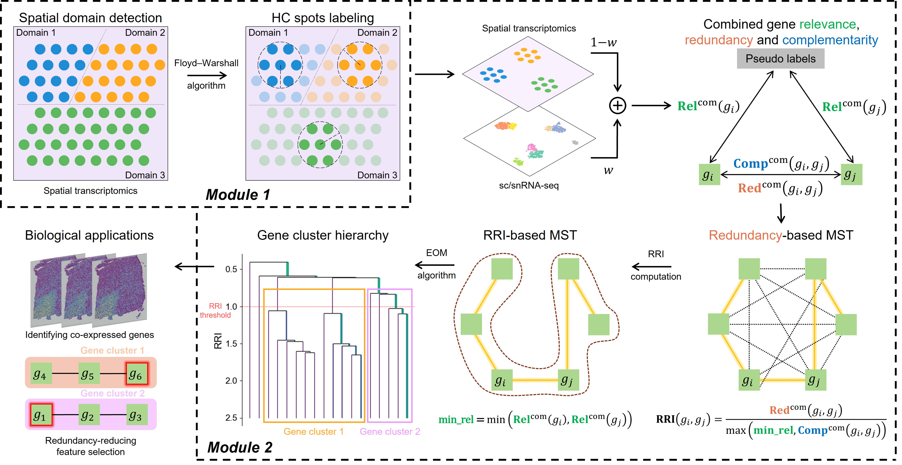

# LEGEND: An integrative algorithm for identifying co-expressed and cofunctional genes in multimodal transcriptomic sequencing data

We present a novel method called mu**L**timodal co-**E**xpressed **GE**nes fin**D**er (LEGEND) that performs integrated gene clustering on scRNA-seq and SRT data to identify co-expressed genes at both the cell type and tissue domain levels. LEGEND performs a hierarchical gene clustering with the aim of maximizing intra-cluster redundancy and inter-cluster complementarity.




## Dependencies
- anndata>=0.8.0
- numpy>=1.21.6
- scanpy>=1.9.3
- loguru>=0.6.0
- scipy>=1.9.3
- hdbscan>=0.8.29
- scikit-learn>=1.2.0
- pandas>=1.5.2
- SpaGCN>=1.2.5
- igraph>=0.10.2
- leidenalg>=0.9.1
- squidpy>=1.2.2
- torch>=1.13.1
- opencv-python>=4.6.0

## Installation

You can download the package from GitHub and install it locally:

```shell
git clone https://github.com/ToryDeng/LEGEND.git
cd LEGEND/
pip install dist/LEGEND-0.1.0-py3-none-any.whl
```

## Getting started

If `adata_rna` is the sc/snRNA-seq dataset and `adata_st` is the ST dataset (the histology image is optional), you can run LEGEND as follows:
```python
import LEGEND as lg

info_rna, _ = lg.GeneClust(adata_rna, return_info=True)
# if the histology image is available
info_st, _ = lg.GeneClust(adata_st, image=img, return_info=True)
# if the histology image is not available
info_st, _ = lg.GeneClust(adata_st, return_info=True)

integration_info, integrated_genes = lg.integrate(info_rna, info_st, return_info=True)
```
For more details about how to call the functions, please refer to the [**Tutorial**](https://torydeng.github.io/LEGEND/).

## Tested environment

### Environment 1

- CPU: Intel(R) Xeon(R) Platinum 8255C CPU @ 2.50GHz
- Memory: 256 GB
- System: Ubuntu 20.04.5 LTS
- Python: 3.9.15

### Environment 2

- CPU: Intel(R) Xeon(R) Gold 6240R CPU @ 2.40GHz
- Memory: 256 GB
- System: Ubuntu 22.04.3 LTS
- Python: 3.9.18

## Citation

Coming soon.
